# 礼堂第一人民医院管理系统
链接：[礼堂第一人民医院]([https://www.openai.com](https://pxxx666-litanghis-2023.deno.dev))

## 1.项目特点

1. 医生信息卡片化处理，使用了animation.css，使用户能够更好的体验
2. 对axios进行了二次封装，提升代码的复用率，降低冗余，便于后期维护和调整
3. 对需要复用的组件进行封装管理，降低代码复用
4. 权限管理，对无权访问的页面进行了拦截，保证了系统的安全性
5. 首屏加载优化（路由懒加载，图片懒加载等）

## 2.角色

**管理员**：

个人信息管理（基本信息，密码），医生录入管理，医生信息管理，科室信息管理，患者挂号管理，患者住院管理，数据分析屏

**医生**：

个人信息管理（基本信息，密码），医生排版信息查看，今日预约医生信息查看，我的挂号（医生），患者住院详情，数据分析屏

**患者**：

个人信息管理（基本信息，密码），医生信息排版查看，充值服务（模拟），预约医生，我的挂号（患者），我的住院详情，数据显示屏

## 3.技术栈

**前端：** Vue3,ElementPlus,Axios,Echarts,Pinia,Vue-Router等

**后端：** SpringBoot,Mybaits,JWT等

**数据库：** MySQL8.0，Redis7

**开发工具：** idea，webstorm

## 4.项目展示

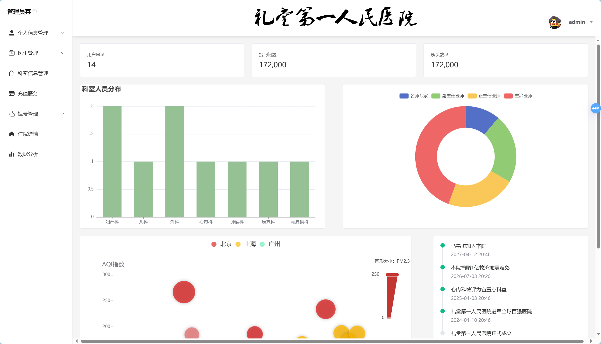
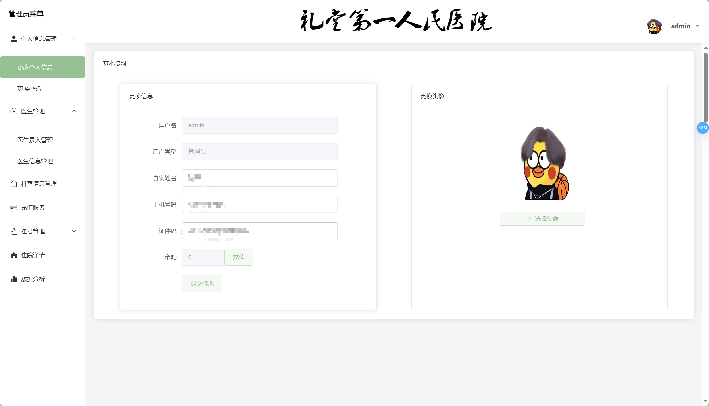
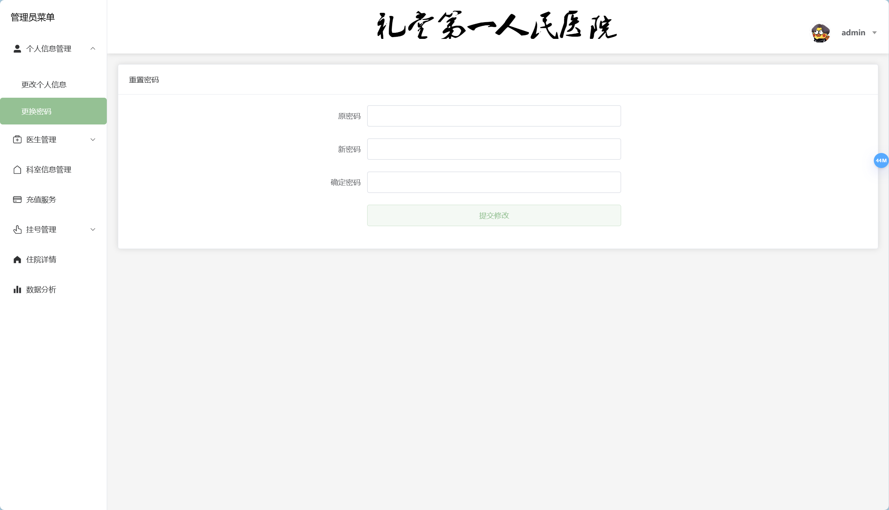
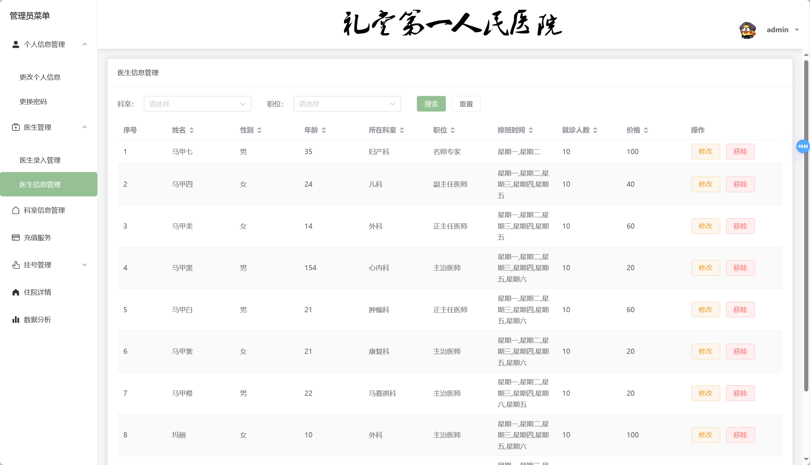
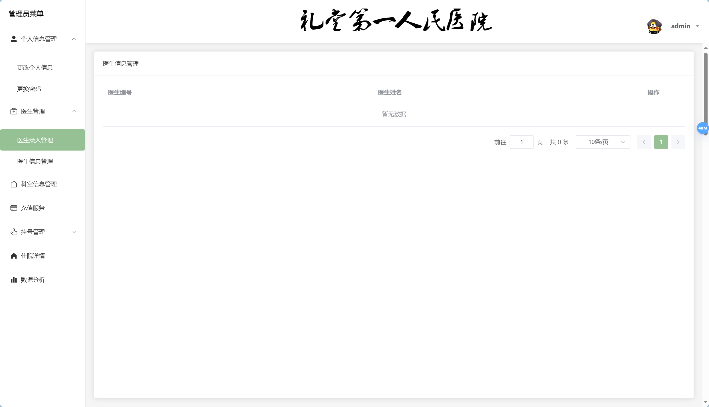
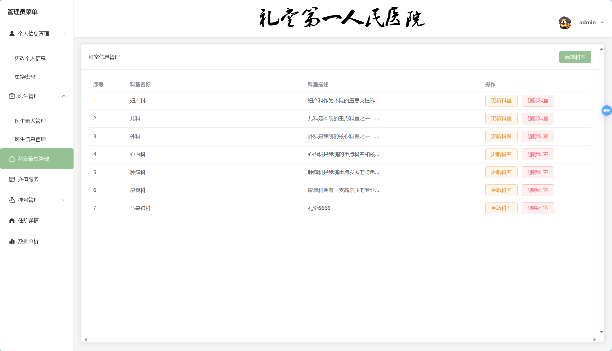
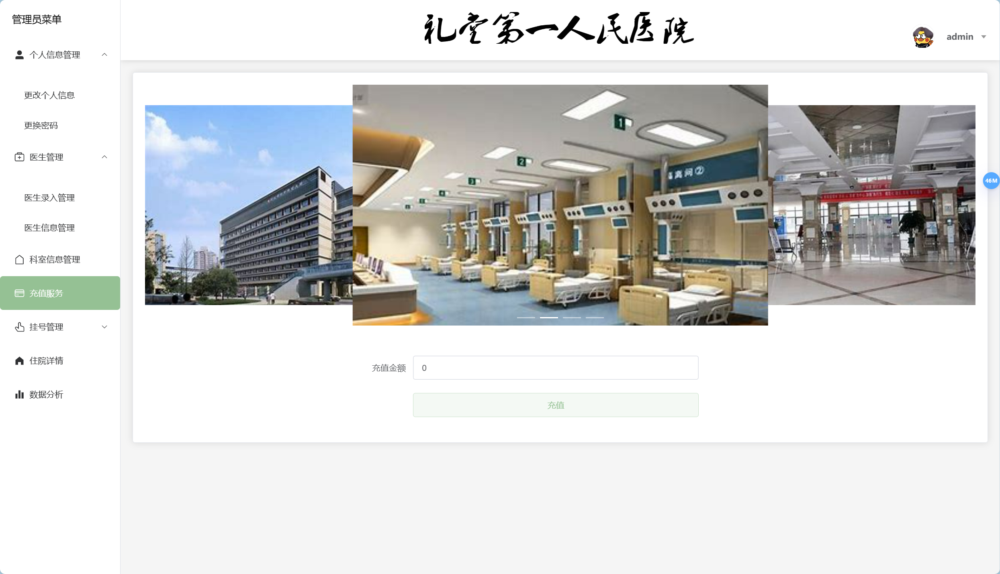
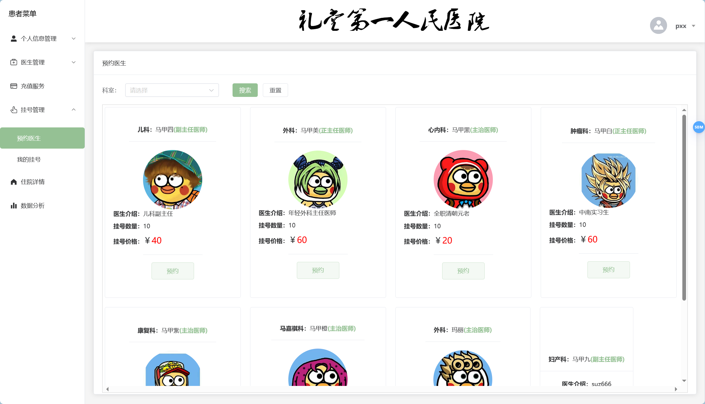
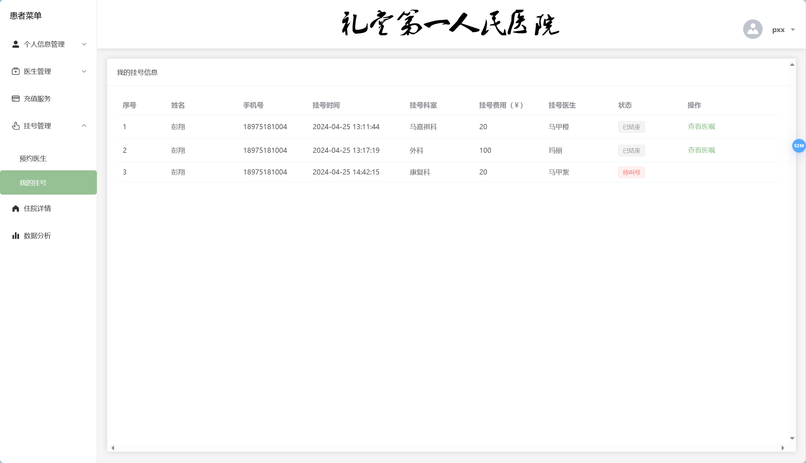
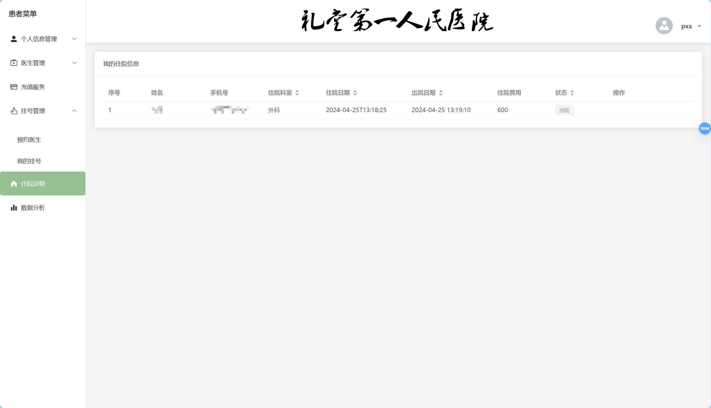
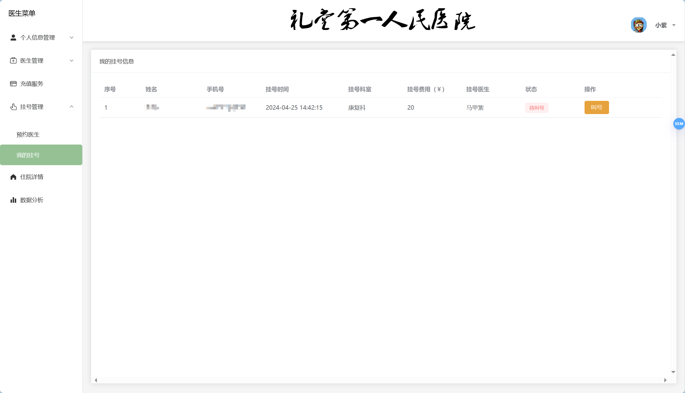

